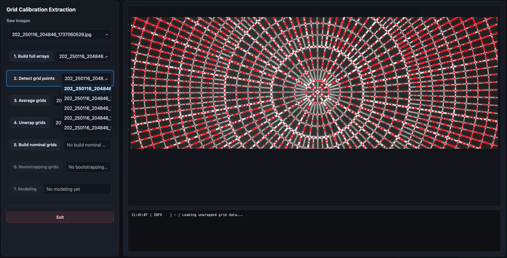

GUI Interface
=============

The grid calibration GUI is organized around a workflow-oriented layout designed
to guide the user through the calibration process from beginning to end.

The interface is divided into three main regions:

- the workflow panel on the left,
- the visualization panel on the right,
- and the live log window at the bottom.

Main Layout
-----------

The GUI is intentionally designed to mirror the pipeline structure.

Each workflow step produces a product that becomes the input for the following
steps, and the interface exposes this dependency chain visually.

Left Workflow Panel
-------------------

The left-side panel contains the complete workflow.

Each row corresponds to one pipeline step.

Examples include:

- full-array generation,
- grid-point detection,
- nominal-grid assignment,
- modeling.

Executed vs Non-Executed Steps
~~~~~~~~~~~~~~~~~~~~~~~~~~~~~~

Steps that have already been executed contain valid products and become
interactive.

Steps that have not yet been executed remain disabled until all required
upstream products exist.

This makes the workflow progression explicit and prevents invalid execution
orders.

Active Step Highlighting
~~~~~~~~~~~~~~~~~~~~~~~~

The currently displayed step is highlighted with a blue outline.

This indicates which product is currently shown in the visualization panel.

The active step may differ from the most recently executed step because users
can freely revisit previous stages.

Per-Input vs Singleton Products
~~~~~~~~~~~~~~~~~~~~~~~~~~~~~~~

Some workflow stages generate one product per input image.

Examples include:

- full-array,
- grid-points.

These steps display interactive dropdown menus allowing users to select which
image product to inspect.

Other stages generate a single shared product for the entire workflow.

Examples include:

- averaged-grid,
- nominal-grid,
- bootstrapping-grid,
- modeling-results.

These singleton steps display a non-interactive product label instead of a true
dropdown menu.

Returning to Previous Steps
~~~~~~~~~~~~~~~~~~~~~~~~~~~

Previously completed workflow stages remain accessible throughout the session.

Users may revisit earlier products at any time without recomputing the pipeline.

This is extremely useful for:

- validating intermediate results,
- diagnosing problems,
- comparing outputs,
- tuning parameters,
- and understanding failure modes.

Main Visualization Panel
------------------------

The large right-side panel displays the currently selected product.

Depending on the active workflow stage, this area may show:

- images,
- detected grid points,
- unwrapped polar coordinates,
- nominal assignments,
- residual maps,
- diagnostic plots.

Interactive Plot Controls
~~~~~~~~~~~~~~~~~~~~~~~~~

Most visualizations support interactive navigation through Plotly.

Users can:

- zoom by click-and-dragging,
- pan the view,
- inspect points through hover interactions,
- reset the zoom by double-clicking.

These interactions are particularly important during:

- center selection,
- nominal assignment inspection,
- residual analysis.

Interactive Workflow Controls
~~~~~~~~~~~~~~~~~~~~~~~~~~~~~

Some steps dynamically add additional controls to the visualization area.

Examples include:

- center confirmation buttons,
- nominal assignment editors,
- parameter tuning controls,
- interactive selection panels.

These controls appear only when relevant to the currently selected step.

Live Log Window
----------------

The bottom panel displays live processing logs.

The logs provide real-time feedback about:

- current processing stages,
- warnings,
- fitting diagnostics,
- progress updates,
- error messages.

The log output is especially useful for diagnosing:

- failed detections,
- invalid products,
- fitting instabilities,
- parameter problems.

The log automatically updates while processing steps are running.

Workflow Persistence
--------------------

All generated products are stored on disk.

Closing and reopening the GUI restores previously discovered products whenever
possible.

The session system automatically rebuilds the workflow state from the discovered
products at startup.

Stale downstream products are automatically ignored if required upstream
products are missing.