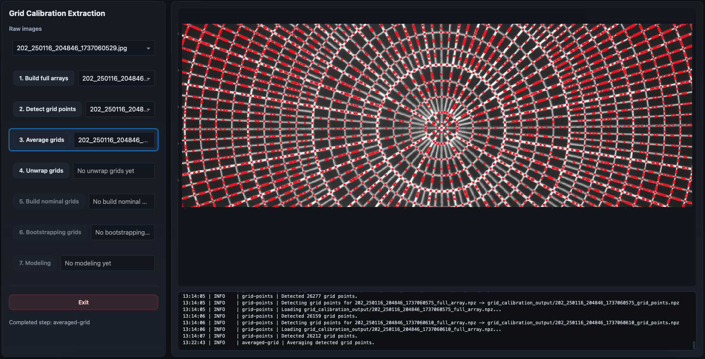

Averaged Grid
=============

The averaged-grid step combines the grid-point detections from multiple images
into a single consensus grid.

This is the first *singleton-product* stage of the workflow.

Overview
--------

The previous step detects candidate grid intersections independently in each
input image.

Although the detections are generally very good, individual images may still
contain:

- missing points,
- false detections,
- noisy regions,
- or small positional variations.

The goal of the averaged-grid step is to combine all these detections into a
single robust consensus grid.

GUI Example
-----------

The averaged result is displayed as a single grid of detected intersections
overlaid on the calibration image.

Because this is a singleton step, there is only one averaged-grid product for
the entire calibration session.

Inputs
------

This step consumes the per-input grid-point products generated in the previous
stage.

Typical input products:

.. code-block:: text

    *_grid_points.npz

Outputs
-------

This step generates one singleton averaged-grid product.

Typical output product:

.. code-block:: text

    *_averaged_grid.npz

The product contains:

- the averaged grid-point coordinates,
- and the number of contributing images for each averaged point.

Why Averaging is Useful
-----------------------

The calibration setup assumes that the camera and calibration target remain
fixed across the image sequence.

Under this assumption, true grid intersections should appear at nearly identical
locations in all images.

Meanwhile:

- noise,
- false positives,
- and unstable detections

tend to vary between images.

By averaging detections across multiple images, the workflow becomes much more
robust.

The averaged grid typically contains:

- cleaner point locations,
- fewer spurious detections,
- improved stability,
- and more uniform coverage.

What the Algorithm Does
-----------------------

The averaging algorithm is intentionally simple and geometric.

The workflow:

1. loads all grid-point detections,
2. combines them into one large point cloud,
3. builds a KD-tree for neighbor searches,
4. clusters nearby detections,
5. averages clusters supported by enough images,
6. rejects weak or isolated detections.

The implementation uses a KD-tree from ``scipy.spatial.cKDTree`` to identify
nearby detections efficiently. 

Cluster Formation
~~~~~~~~~~~~~~~~~

Two detections are considered part of the same cluster if they lie within a
small Euclidean distance threshold.

The current default matching tolerance is:

.. code-block:: text

    5 pixels

Clusters are then averaged to produce a single consensus point.

Minimum Support Requirement
~~~~~~~~~~~~~~~~~~~~~~~~~~~

Clusters must be supported by detections from multiple distinct images.

The current default requirement is:

.. code-block:: text

    at least 3 images

This greatly reduces unstable or accidental detections.

GUI Interaction
---------------

The averaged grid is displayed as red markers over the calibration image.

Users should verify that:

- the grid remains dense and uniform,
- isolated false detections have mostly disappeared,
- coverage remains strong across the field of view,
- and the averaged points still align with the visible intersections.

Plot Interaction
~~~~~~~~~~~~~~~~

The visualization supports standard Plotly navigation:

- click-and-drag zoom,
- pan,
- hover inspection,
- double-click reset.

What a Good Result Looks Like
-----------------------------

A good averaged grid generally has:

- smooth and consistent point spacing,
- strong agreement with the visible grid,
- very few isolated outliers,
- good coverage across the field,
- and stable point placement.

The averaged grid should visually appear cleaner and more stable than the
individual per-image detections.

Next Step
---------

The next workflow stage is:

:doc:`unwrapped_grid`

which converts the averaged grid into a polar ``(theta, r)`` representation for
nominal assignment.