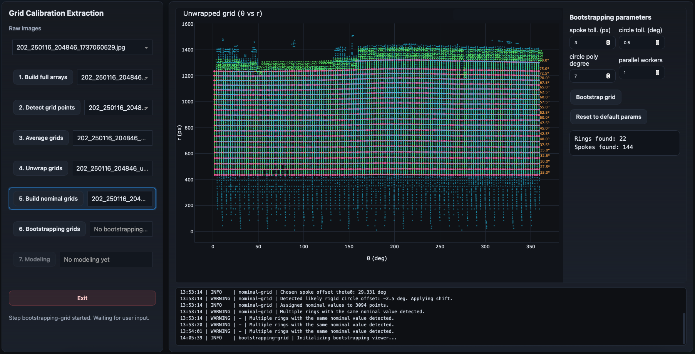
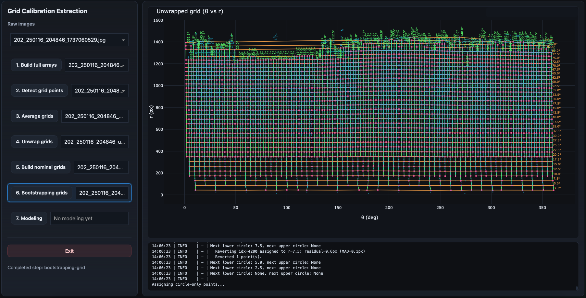

Bootstrapping Grid
==================

The bootstrapping-grid step expands the validated nominal assignment into a much
denser calibration grid.

This stage propagates the trusted ring and spoke structure identified in the
previous step to additional measured intersections that were not part of the
initial nominal assignment.

Overview
--------

The nominal-grid step intentionally focuses on producing a *clean and reliable*
assignment.

At this stage, many detected points may still remain unlabeled.

The goal of the bootstrapping step is to extend the nominal solution to those
remaining detections while preserving consistency with the validated geometry.

This produces an expanded grid with much richer spatial coverage. Covering the
inner regions of the image is particularly important for accurate distortion modeling.

Interactive Initialization
--------------------------

When the step begins, the GUI displays the validated nominal assignment together
with the bootstrapping controls.

The side panel exposes the main bootstrapping parameters.

Unlike the nominal-grid stage, this step usually requires little manual
interaction beyond parameter tuning.

Why Bootstrapping is Needed
---------------------------

The nominal-grid step prioritizes robustness and geometric consistency.

As a result:

- ambiguous detections may be excluded,
- fragmented structures may remain incomplete,
- sparse regions may not receive assignments.

However, the final distortion model benefits greatly from having:

- more calibration points,
- broader spatial coverage,
- denser ring sampling,
- denser spoke sampling.

The bootstrapping stage expands the trusted nominal solution into these missing
regions.

Inputs
------

This step combines information from several previous products:

- the nominal-grid assignment,
- the averaged detected grid,
- the selected unwrapping center.

Typical inputs:

.. code-block:: text

    *_nominal_grid.npz
    *_averaged_grid.npz
    *_unwrapped_grid.npz

Outputs
-------

This step generates one singleton bootstrapped-grid product.

Typical output product:

.. code-block:: text

    *_bootstrapped_grid.npz

The product stores:

- the expanded nominal assignment,
- measured image coordinates,
- measured polar coordinates,
- propagated nominal labels,
- and the bootstrapping parameters used.

High-Level Strategy
-------------------

The algorithm starts from the validated nominal assignment and attempts to
propagate labels into nearby unlabeled detections.

The main idea is:

- trusted rings define smooth radial structures,
- trusted spokes define smooth angular structures,
- nearby unlabeled points can be matched consistently to these structures.

The process effectively "fills in" missing correspondences.

Main Processing Components
--------------------------

The bootstrapping processing package is divided into several specialized
components:

``circles.py``
    Circle fitting and ring propagation logic.

``spokes.py``
    Spoke consistency and spoke assignment propagation.

``geometry.py``
    Polar geometry utilities and coordinate helpers.

``tiers.py``
    Expansion logic controlling how propagation proceeds through the grid.

``records.py``
    Record construction and bookkeeping.

``pipeline.py``
    High-level orchestration of the full bootstrapping process.

Propagation Along Rings
-----------------------

The software first models the already-validated rings.

For each ring:

- the existing assigned points are collected,
- a smooth polynomial model is fitted,
- nearby unlabeled points are tested against the model.

The ring fitting is intentionally flexible because the projected rings are not
perfectly flat in the unwrapped representation.

The parameter:

``circle poly degree``

controls the polynomial complexity used to model ring curvature.

Higher values allow more flexibility but may overfit noisy structures.

Circle Matching
----------------

Candidate unlabeled points are compared against the fitted ring models.

The parameter:

``circle toll. (deg)``

controls the angular tolerance used during matching and snapping.

Points sufficiently close to the predicted ring structure are incorporated into
the solution.

Spoke Consistency
-----------------

The propagated assignments must remain consistent with the spoke geometry.

The parameter:

``spoke toll. (px)``

controls the allowed spoke consistency tolerance in pixel space.

This prevents assignments that would violate the established spoke structure.

Iterative Expansion
-------------------

The propagation proceeds iteratively.

Newly assigned points strengthen the ring models, which in turn allows
additional nearby points to be incorporated.

This iterative growth process gradually expands the calibration grid into sparse
or previously unlabeled regions.

Parallel Processing
-------------------

This step can become computationally expensive for large calibration grids.

The workflow therefore supports multiprocessing.

The parameter:

``parallel workers``

controls the number of worker processes used during bootstrapping.

Using multiple workers is strongly recommended for large datasets.

The callbacks explicitly pass the worker count into the bootstrapping pipeline,
which distributes portions of the propagation work across processes.

Running the Bootstrap
---------------------

Once the parameters are configured, the user clicks:

.. code-block:: text

    Bootstrap grid

The processing may take noticeable time depending on:

- grid density,
- image size,
- polynomial degree,
- and worker count.

The log window reports the ongoing propagation activity.

Final Bootstrapped Grid
-----------------------

Once processing completes, the GUI displays the expanded assignment.

Compared to the nominal-grid stage:

- many more intersections are labeled,
- ring structures extend farther,
- spoke coverage becomes denser,
- and sparse regions become populated.

The bootstrapped solution now contains a much richer set of calibration
correspondences.

What a Good Result Looks Like
-----------------------------

A good bootstrapped grid generally has:

- smooth and continuous ring structures,
- smooth spoke alignment,
- dense point coverage,
- few isolated assignments,
- and visually consistent propagation.

The propagated structures should appear geometrically coherent rather than
fragmented.

Product Registration
--------------------

After processing completes successfully, the bootstrapped assignment is written
to disk and registered automatically in the calibration session.

Next Step
---------

The next workflow stage is:

:doc:`modeling_results`

which fits the final distortion model using the dense bootstrapped
correspondence set.