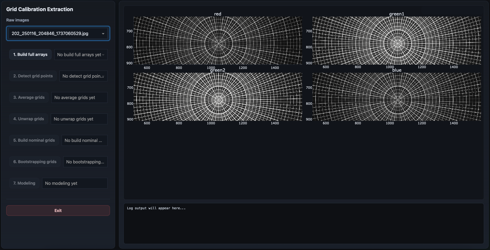

Full Array
==========

The full-array step converts the raw Bayer-channel calibration images into
combined full-sensor image products suitable for grid-point detection.

This is the first true processing stage of the workflow.

Overview
--------

GONet camera sensors acquire images using a Bayer mosaic pattern.

Each pixel belongs to one of several color channels:

- red,
- green1,
- green2,
- blue.

These channels are sampled at different physical detector locations and often
have different sensitivities, noise properties, and illumination responses.

The goal of the full-array step is to:

- reconstruct the full sensor geometry,
- normalize channel responses,
- and create a unified image representation optimized for downstream
  grid-point detection.

GUI Example
-----------

The visualization panel displays the individual Bayer channels separately.

This allows users to inspect:

- channel uniformity,
- contrast differences,
- saturation,
- illumination gradients,
- and detector artifacts.

Inputs
------

The full-array step consumes the raw calibration images provided at launch.

Outputs
-------

This step generates one full-array product per input image.

These are *per-input products*.

Typical product names:

.. code-block:: text

    *_full_array.npz

Purpose
-------

The calibration model is applied to the *physical sensor geometry*, not to the
individual Bayer channels independently.

The full-array step therefore reconstructs a combined detector representation
that preserves the spatial geometry of the original sensor.

At the same time, the different color channels often have significantly
different response distributions.

Without correction:

- some channels may dominate the signal,
- grid contrast may vary strongly across the image,
- and downstream thresholding becomes less stable.

Histogram Matching
------------------

To compensate for these differences, the channels are normalized through
histogram matching.

The ``green1`` channel is used as the reference channel.

The remaining channels are transformed so that their pixel-value distributions
match the reference distribution as closely as possible.

This improves:

- channel consistency,
- contrast uniformity,
- grid visibility,
- and downstream detection robustness.

The histograms are shown in the GUI on the panels to the right of the full-array images.
If the matching is successful, the histograms should be closely aligned between channels.

Why Green1?
-----------

The green channels typically provide:

- the highest sampling density,
- strong signal-to-noise,
- and stable detector response.

Using ``green1`` as the histogram reference generally produces the most stable
results across the sensor.

Relationship with GONet Wizard
------------------------------

The low-level Bayer handling and histogram matching are performed through the
GONet Wizard utilities.

The grid calibration package uses these routines to build the full-array
products used throughout the remainder of the pipeline.

What a Good Result Looks Like
-----------------------------

A good full-array result generally has:

- smooth contrast across channels,
- clearly visible grid lines,
- minimal channel-to-channel brightness differences,
- and strong visibility of the calibration target across the full field.

The grid should appear visually consistent between channels.

Next Step
---------

The next workflow stage is:

:doc:`grid_points`

which detects candidate grid intersections from the full-array products.