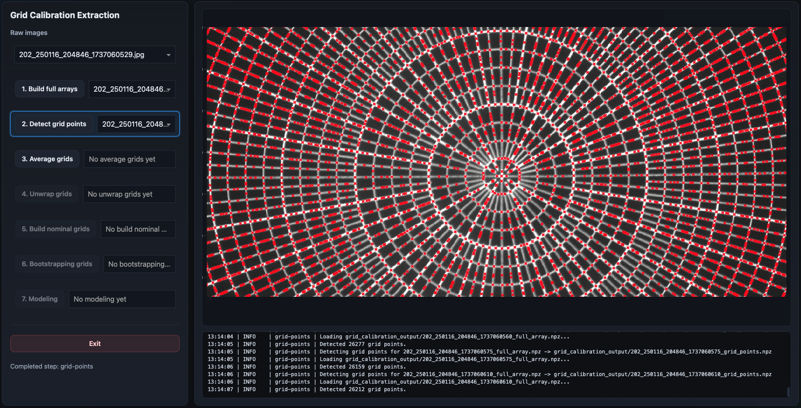

Grid Points
===========

The grid-points step detects candidate intersections of the calibration grid in
each full-array image.

This is the first stage where the software identifies the physical calibration
pattern directly.

Overview
--------

The goal of this step is to find the bright grid intersections in each processed
full-array image.

The detected points are shown as red markers over the full-array image.

Each input image receives its own grid-points product, so this is a
*per-input* step. The dropdown menu on the left can be used to inspect the
detections for each image separately.

Inputs
------

This step consumes the full-array products generated by the previous step.

Typical input products:

.. code-block:: text

    *_full_array.npz

Outputs
-------

This step generates one grid-points product per input image.

Typical output products:

.. code-block:: text

    *_grid_points.npz

Each product stores an array of detected grid-point coordinates.

What the Algorithm Does
-----------------------

The detection algorithm is intentionally simple and image-based.

For each full-array image, the software:

1. loads the full-array image product,
2. applies a small Gaussian blur,
3. applies a much broader Gaussian blur,
4. subtracts the broad blur from the small blur,
5. clips negative values to zero,
6. smooths the enhanced image again,
7. identifies local maxima,
8. saves the resulting peak coordinates.

In code, the core operation is a difference-of-Gaussians enhancement:

.. code-block:: python

    small = gaussian(image, sigma=1.5, preserve_range=True)
    large = gaussian(image, sigma=10.0, preserve_range=True)
    dog = small - large
    dog[dog < 0] = 0

The result emphasizes compact bright structures while suppressing broad
background variations.

A final smoothed peak image is then passed to ``peak_local_max``:

.. code-block:: python

    smoothed_peaks = gaussian(dog, sigma=1.0, preserve_range=True)
    peaks = peak_local_max(smoothed_peaks**2, threshold_rel=threshold_rel)

The detected peaks are saved as the grid-point coordinates. The current default
relative detection threshold is ``0.1``. 

Why This Works
--------------

Grid intersections are usually compact, bright features.

Large-scale illumination gradients, shadows, and broad background structures
change more slowly across the image.

The difference-of-Gaussians filter removes much of the slow background while
preserving the sharper intersection peaks.

This makes the later local-maximum detection more stable.

GUI Interaction
---------------

After the step runs, the visualization panel shows:

- the full-array image in grayscale,
- detected grid points as red markers,
- one selectable result per input image.

Users can inspect all the images using the dropdown menu.

Plot Interaction
~~~~~~~~~~~~~~~~

The plot supports standard Plotly navigation:

- click and drag to zoom,
- pan the image,
- hover over points,
- double-click to reset the view.

What a Good Result Looks Like
-----------------------------

A good detection result has red markers placed near the true grid intersections.

The markers should:

- cover most visible rings and spokes,
- follow the grid structure cleanly,
- avoid large numbers of background false positives,
- avoid missing entire regions of the grid,
- remain reasonably consistent across input images.

Some imperfect detections are acceptable because later steps aggregate and
clean the detections.

Next Step
---------

The next workflow stage is:

:doc:`averaged_grid`

which combines the detected points from multiple images into a single consensus
grid.