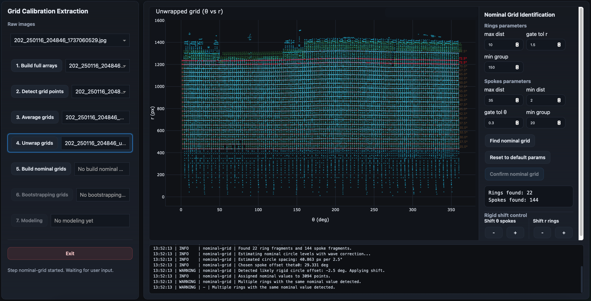
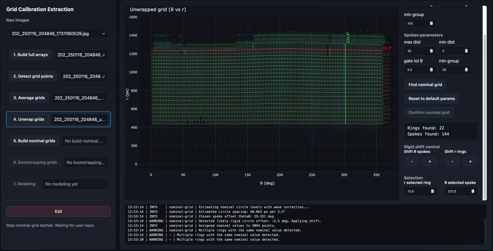
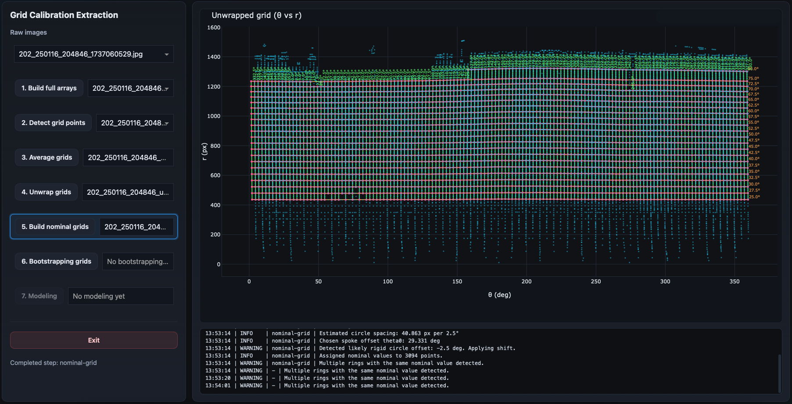

Nominal Grid
============

The nominal-grid step assigns ideal ring and spoke labels to the measured
unwrapped grid.

This is the first major interpretation step: the software no longer works only
with detected points, but tries to understand which ideal calibration-grid
coordinate each measured point represents.

Overview
--------

When the step is triggered, the software immediately attempts an initial nominal
assignment using the default parameters.

The user then reviews the result, adjusts parameters or labels if needed, and
confirms the assignment once it is correct.

The unwrapped grid is shown in ``theta`` vs ``r`` space. The detected points are
displayed in cyan, while the identified nominal ring and spoke structure is
overplotted.

Why This Step Matters
---------------------

The previous step produced measured polar coordinates:

.. code-block:: text

    theta, r

But the distortion model needs correspondences between measured image positions
and ideal calibration-grid coordinates.

The nominal-grid step creates those correspondences by assigning each usable
detected point to:

- a nominal ring radius,
- a nominal spoke angle.

These assigned nominal coordinates become the reference geometry for the later
bootstrapping and modeling steps.

Inputs
------

This step consumes the singleton unwrapped-grid product.

Typical input product:

.. code-block:: text

    *_unwrapped_grid.npz

Outputs
-------

This step generates one singleton nominal-grid product.

Typical output product:

.. code-block:: text

    *_nominal_grid.npz

The product stores:

- the assigned points,
- measured pixel coordinates,
- measured polar coordinates,
- nominal ring labels,
- nominal spoke labels,
- and the parameters used to create the assignment.

What the Algorithm Does
-----------------------

The nominal-grid algorithm works in the unwrapped ``theta`` vs ``r`` plane.

In this representation:

- rings appear approximately horizontal,
- spokes appear approximately vertical.

The algorithm therefore tries to identify two families of structures:

- ring fragments,
- spoke fragments.

Ring Grouping
~~~~~~~~~~~~~

Ring grouping searches for point chains with similar radial coordinate ``r``.

The goal is to identify measured fragments that belong to the same circular
grid ring.

The main ring parameters control:

``max dist``
    Maximum linking distance between neighboring points.

``gate tol r``
    Allowed radial tolerance when deciding whether points belong to the same
    ring-like chain.

``min group``
    Minimum number of points required for a ring group to be retained.

Spoke Grouping
~~~~~~~~~~~~~~

Spoke grouping searches for point chains with similar angular coordinate
``theta``.

The goal is to identify measured fragments that belong to the same radial grid
spoke.

The main spoke parameters control:

``max dist``
    Maximum linking distance between neighboring points.

``min dist``
    Minimum distance used to avoid linking points that are too close or
    ambiguous.

``gate tol theta``
    Allowed angular tolerance when linking points into spoke-like chains.

``min group``
    Minimum number of points required for a spoke group to be retained.

Nominal Assignment
~~~~~~~~~~~~~~~~~~

Once ring and spoke fragments are identified, the software estimates the nominal
grid spacing and assigns each group to the nearest ideal calibration value.

For this calibration grid, nominal values are assigned on a regular angular
grid, typically in steps of:

.. code-block:: text

    2.5 degrees

The final assignment connects each measured point to both:

- one nominal ring,
- one nominal spoke.

Automatic Checks
----------------

The nominal-grid step includes several automatic consistency checks.

Rigid Shift Check
~~~~~~~~~~~~~~~~~

Sometimes the detected rings or spokes are internally consistent but shifted by
one nominal step.

The software checks for a likely rigid offset and can automatically apply a
correction.

The log reports this behavior, for example:

.. code-block:: text

    Detected likely rigid circle offset: -2.5 deg. Applying shift.

The user can also manually apply global shifts using the controls on the right.

Duplicate Ring or Spoke Labels
~~~~~~~~~~~~~~~~~~~~~~~~~~~~~~

If two detected rings or spokes receive the same nominal value, the assignment is
ambiguous.

When this happens:

- the conflicting structures are marked in red,
- the confirm button is disabled,
- the user must correct the assignment before continuing.

The callbacks explicitly disable confirmation when multiple conflicts are
present, and the final product is written only when the user confirms a valid
assignment. 

Interactive Review
------------------

After the initial assignment, the user should inspect the result carefully.

The right-side control panel allows the user to:

- change grouping parameters,
- rerun nominal detection,
- reset parameters to defaults,
- shift all spokes,
- shift all rings,
- select individual intersections,
- edit selected nominal values,
- confirm the final nominal grid.

Rerunning the Detection
~~~~~~~~~~~~~~~~~~~~~~~

If the first result is poor, adjust the parameters and click:

.. code-block:: text

    Find nominal grid

This reruns the nominal assignment with the current parameter values.

Common reasons to rerun include:

- too few rings found,
- too few spokes found,
- duplicate labels,
- obvious misalignment,
- poor grouping in one region.

Selecting and Editing Points
----------------------------

The user can select an intersection in the plot.

When a point is selected:

- the corresponding ring is highlighted,
- the corresponding spoke is highlighted,
- editing controls appear in the side panel.

The selected ring and spoke values can then be changed manually.

When a selected point is edited, the software updates the corresponding ring or
spoke assignment across all affected points. The input values are coerced to the
valid nominal grid spacing before being applied. 

Rigid Shift Controls
--------------------

The side panel includes controls for applying global shifts.

These are useful when the entire solution is correct in shape but offset by one
or more nominal steps.

The user can shift:

- all spokes by ``±2.5°``,
- all rings by ``±2.5°``.

This is often faster than editing individual structures.

Confirming the Product
----------------------

Once the assignment is correct and no conflicts remain, the user clicks:

.. code-block:: text

    Confirm nominal grid

At that point, the nominal-grid product is saved to disk and registered in the
session. 

What a Good Result Looks Like
-----------------------------

A good nominal assignment has:

- all real rings identified once,
- all real spokes identified once,
- smooth and ordered labels,
- no duplicate nominal values,
- no unexplained red conflict markers,
- and good visual agreement between labels and the point cloud.

The ring labels should increase smoothly with radius.

The spoke labels should progress smoothly with angle.

Next Step
---------

The next workflow stage is:

:doc:`bootstrapping_grid`

which uses the validated nominal assignment to extend the calibration
correspondences into a denser bootstrapped grid.