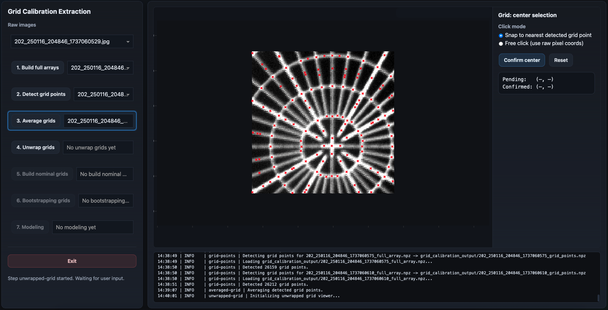
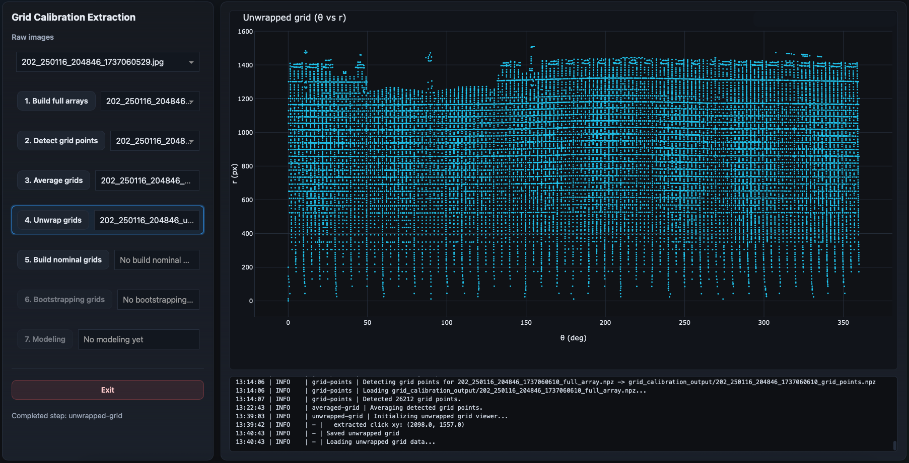

Unwrapped Grid
==============

The unwrapped-grid step converts the averaged image-space grid into a polar
representation centered on the optical axis of the calibration pattern.

This is the first interactive stage of the workflow.

Overview
--------

The previous steps operate directly in image-space coordinates:

.. code-block:: text

    (x, y)

However, the calibration target itself is naturally organized in polar geometry:

- concentric rings,
- radial spokes,
- angular spacing.

To simplify the later nominal assignment stage, the workflow converts the grid
into polar coordinates:

.. code-block:: text

    (theta, r)

where:

- ``theta`` is the angular coordinate around the center,
- ``r`` is the radial distance from the center.

This process is referred to as *unwrapping* the grid.

Why Unwrapping is Necessary
---------------------------

The original calibration pattern is circular.

In image space, the grid intersections follow curved structures that are
difficult to organize algorithmically.

After unwrapping:

- rings become approximately horizontal structures,
- spokes become approximately vertical structures,
- periodic angular structure becomes explicit.

This transformation makes the later grouping and nominal assignment steps much
simpler and more robust.

The Importance of the Center
----------------------------

The unwrapping transformation depends entirely on the selected center.

All polar coordinates are computed relative to this point.

A poor center estimate can significantly distort the unwrapped representation
and make later steps fail.

The workflow therefore asks the user to manually identify the grid center.

Step 1 — Center Selection
-------------------------

When the step begins, the GUI enters interactive center-selection mode.

The averaged grid is displayed together with the detected grid points.

A control panel appears on the right side of the interface.

The user must click the location corresponding to the apparent center of the
grid.

Center Selection Modes
----------------------

The interface provides two selection modes.

Snap Mode
~~~~~~~~~

Default mode:

.. code-block:: text

    Snap to nearest detected grid point

In this mode, the clicked position is automatically snapped to the nearest
detected averaged-grid point.

This is usually the preferred option because:

- the center often coincides with a true intersection,
- snapping improves reproducibility,
- the selected point remains consistent with the detected geometry.

The callback system internally identifies the nearest detected point and reports
the snapped distance and point index. 

Free Click Mode
~~~~~~~~~~~~~~~

Alternative mode:

.. code-block:: text

    Free click (use raw pixel coords)

In this mode, the exact mouse coordinates are used directly without snapping.

This mode is useful when:

- the center does not coincide with a detected point,
- the central intersections are poorly detected,
- or the user wants finer manual control.

Step 2 — Pending Center
-----------------------

After clicking, the interface displays a pending center marker.

The control panel reports:

- the pending coordinates,
- the snapped point index (if applicable),
- and the snap distance.

At this stage, the center is not yet finalized.

Users may:

- click elsewhere,
- switch selection modes,
- or reset the selection entirely.

Confirming the Center
---------------------

Once satisfied, the user presses:

.. code-block:: text

    Confirm center

The selected center becomes the reference point for the unwrapping transform.

The workflow then automatically computes the polar coordinates for every
averaged-grid point.

Unwrapping Transformation
-------------------------

For each detected averaged-grid point, the workflow computes:

- the radial distance from the selected center,
- the angular position around the center.

Internally, this is computed using:

.. code-block:: python

    r = hypot(dx, dy)
    theta = arctan2(dy, dx)

The angular coordinates are then converted into degrees and wrapped into the
range:

.. code-block:: text

    [0°, 360°)

The resulting coordinates are sorted by angular position before being saved. 

Step 3 — Final Unwrapped Representation
---------------------------------------

Once the center is confirmed, the GUI switches automatically to the unwrapped
view.

The plot now displays:

- angular coordinate on the horizontal axis,
- radial coordinate on the vertical axis.

The original circular grid structure becomes approximately rectangular.

Interpretation of the Unwrapped Grid
------------------------------------

In the unwrapped representation:

- concentric rings become nearly horizontal bands,
- radial spokes become nearly vertical structures,
- periodic angular patterns become explicit.

This representation is the foundation for the nominal-grid assignment stage.

Inputs
------

This step consumes the singleton averaged-grid product.

Typical input product:

.. code-block:: text

    *_averaged_grid.npz

Outputs
-------

This step generates one singleton unwrapped-grid product.

Typical output product:

.. code-block:: text

    *_unwrapped_grid.npz

The product stores:

- original point coordinates,
- polar coordinates,
- point indices,
- selected center coordinates.

GUI Interaction
---------------

The unwrapped-grid stage is highly interactive.

Users can:

- zoom into the image,
- inspect candidate intersections,
- change selection mode,
- reset the center,
- reselect the center.

The plots support standard Plotly navigation:

- click-and-drag zoom,
- pan,
- hover inspection,
- double-click reset.

What a Good Result Looks Like
-----------------------------

A good unwrapped grid generally has:

- smooth horizontal ring structures,
- clear vertical spoke structures,
- minimal distortions or discontinuities,
- stable angular ordering,
- and dense coverage across the full angular range.

The structures should appear visually organized rather than chaotic.

Next Step
---------

The next workflow stage is:

:doc:`nominal_grid`

which identifies the nominal ring and spoke structure of the calibration grid.