Distortion Model for Fisheye Polar Grid Calibration
===================================================

Overview
--------

This module implements a distortion model for fisheye camera calibration
using a polar calibration grid composed of concentric circles and radial spokes.

The goal of this model is to:

- Recover the **distortion center** (≈ optical center / FoV center)
- Map pixel coordinates → angular coordinates
- Accurately describe **anisotropic distortions** across the field

The calibration is performed using a set of grid intersection points with known
nominal polar coordinates.

.. note::

   The model is intentionally **non-physical** (i.e., not tied to a specific lens model),
   and instead uses a flexible smooth basis to capture real-world distortions.

---

Data Model
----------

Each calibration point contains:

- Measured pixel coordinates:
  - ``pixel_x``, ``pixel_y``

- Measured polar coordinates (from approximate center):
  - ``r`` (pixels)
  - ``theta`` (degrees)

- Nominal grid coordinates:
  - ``nominal_r`` (degrees)
  - ``nominal_theta`` (degrees)

These are stored in a ``.npz`` file under the ``data`` key.

.. seealso::

   :doc:`index` is the entry point for the calibration-model documentation.
   :doc:`model_components` gives a geometric, component-by-component
   interpretation of the forward model, including schematic illustrations of
   the effect of each term on an ideal polar grid.

---

.. _calibration-reference-limitations:

Calibration Reference and Scope
-------------------------------

The nominal angular coordinates used by this model are defined by the polar
calibration grid projected onto the dome of the **Grainger Sky Theater at the
Adler Planetarium**.  The fit therefore assumes that the nominal projected rings
and spokes are the reference geometry against which the camera is calibrated.

That assumption is necessary, but it is not equivalent to having a perfect
absolute calibration standard.  The realized pattern can contain small
systematic departures from its nominal geometry due to effects such as:

- projector alignment and projection optics;
- small relative misalignments among projectors;
- local dome geometry or surface imperfections;
- other repeatable differences between the designed and realized pattern.

Because the distortion model is empirical and flexible, it cannot determine
from the grid images alone whether a repeatable geometric feature originates in
the camera or in the projected reference.  It will fit both.  A calibration
produced by this procedure should therefore be interpreted as a precise mapping
**relative to the realized Grainger projected grid**, rather than as an isolated
physical model of the lens.

This is particularly important when interpreting the high-dimensional harmonic
terms.  Some fitted structure may represent genuine camera distortion, while
some may compensate for imperfections in the reference grid.  Any systematic
error in that reference can propagate into downstream ``pixel_to_angle()``
coordinates even when the grid fit itself has very small residuals.

Independent star-tracking tests have provided evidence that the projected grid
is not a perfectly ideal absolute reference.  Direct calibration from stars
would provide an external celestial angular standard, but dense stellar
sampling over the entire fisheye field is difficult to obtain reliably, with
obstructions toward the horizon being especially limiting.

A promising long-term strategy is therefore to combine the two references:
use the projected grid for dense, repeatable full-field sampling and use stars
for independent absolute validation and, where coverage permits, additional
geometric constraints.  Until such a hybrid solution is mature, the projected
grid remains the practical reference available to this calibration pipeline.

Motivation and Design Choices
-----------------------------

Why not a simple model?
~~~~~~~~~~~~~~~~~~~~~~~

Initial attempts using:

- symmetric radial distortion
- ellipse / decentering models

failed because:

- distortions are **anisotropic**
- distortions vary with **radius and angle**
- residuals showed clear **harmonic structure**

Conclusion:

→ A more flexible, orthogonal basis is required.

---

Why a Polar Harmonic Model?
~~~~~~~~~~~~~~~~~~~~~~~~~~~

The distortion field naturally decomposes into:

- **radial component** (along rays)
- **tangential component** (perpendicular to rays)

This motivates modeling:

.. math::

   d_r(s, \phi), \quad d_{\mathrm{tan}}(s, \phi)

using a Fourier-polynomial basis.

Advantages:

- Matches physical intuition of distortions
- Separates radial and angular effects
- Structured Fourier-polynomial basis with geometrically interpretable
  components, while individual high-order coefficients remain empirical

---

Model Definition
----------------

Coordinates
~~~~~~~~~~~

Let:

- :math:`u = r_{\mathrm{nom}}` in radians
- :math:`s = r_{\mathrm{nom}} / r_{\max}`
- :math:`\phi_0 = \theta_{\mathrm{nom}} + \theta_0`

where :math:`\theta_0` is a global rotation offset. The current production
model also includes a radius-dependent, axisymmetric angular twist:

.. math::

   \Delta\theta_{\mathrm{twist}}(r) = A\tanh(r / \tau),

with :math:`\tau = 20^\circ` by default. The final local angular frame is

.. math::

   \phi = \phi_0 + \Delta\theta_{\mathrm{twist}}(r).

The twist vanishes at the center and smoothly approaches the fitted amplitude
:math:`A` toward the outer field.

---

1. Symmetric Radial Model
~~~~~~~~~~~~~~~~~~~~~~~~~

We first model an ideal radial mapping:

.. math::

   \rho(u) = k_1 u + k_2 u^2 + \dots + k_N u^N

This captures the dominant fisheye behavior:

- approximately equidistant: :math:`r \propto \theta`
- with higher-order corrections

---

2. Harmonic Distortion Fields
~~~~~~~~~~~~~~~~~~~~~~~~~~~~~

We introduce separate radial and tangential correction fields. Their Fourier
bases are evaluated in the untwisted frame :math:`\phi_0`:

.. math::

   d_r(s, \phi_0) = \sum_{m,n} a_{m,n} \, s^m
   \{\cos(n\phi_0), \sin(n\phi_0)\}

.. math::

   d_{\mathrm{tan}}(s, \phi_0) = \sum_{m,n} b_{m,n} \, s^m
   \{\cos(n\phi_0), \sin(n\phi_0)\}.

The two fields intentionally have independent complexity. The production
defaults selected through geometric cross-validation are:

- radial correction: :math:`M_r=4`, :math:`N_r=7`;
- tangential correction: :math:`M_t=4`, :math:`N_t=8`.

Here :math:`m` controls radial variation and :math:`n` controls angular
harmonics. Keeping the two fields independent was important: the validation
experiments showed that radial and transverse residual structure do not prefer
exactly the same angular complexity.

---

3. Final Mapping
~~~~~~~~~~~~~~~~

After evaluating the harmonic fields in :math:`\phi_0`, they are projected
through the final twisted frame :math:`\phi`:

.. math::

   x = c_x + (\rho + d_r)\cos\phi - d_{\mathrm{tan}}\sin\phi

.. math::

   y = c_y + (\rho + d_r)\sin\phi + d_{\mathrm{tan}}\cos\phi

where:

- :math:`(c_x, c_y)` is the distortion center

---

Fitting Procedure
-----------------

The model is fit in **three stages**.

Stage 1 — Symmetric Fit
~~~~~~~~~~~~~~~~~~~~~~~

- Fit only :math:`\rho(u)`
- Ignore harmonic terms

Purpose:

- establish stable radial baseline
- estimate center and rotation

---

Stage 2 — Full Harmonic Fit
~~~~~~~~~~~~~~~~~~~~~~~~~~~

- Fit full model including:

  - radial distortion
  - tangential distortion

- Uses robust loss:

  - ``soft_l1``

Purpose:

- capture anisotropic structure

---

Stage 3 — Outlier Rejection
~~~~~~~~~~~~~~~~~~~~~~~~~~~

Outliers are identified using:

.. math::

   \text{threshold} = \mathrm{median} + \sigma \cdot \mathrm{MAD}

Then:

- remove outliers
- refit model on inliers only

Purpose:

- remove contaminated grid detections
- stabilize final solution

---

Key Implementation Details
--------------------------

Parameterization
~~~~~~~~~~~~~~~~

The parameter vector includes:

- Center: ``cx, cy``
- Rotation: ``theta0_deg``
- Symmetric radial coefficients: ``k1, k2, ...``
- Radial harmonic coefficients: ``dr_m*_c*``, ``dr_m*_s*``
- Tangential harmonic coefficients: ``dtan_m*_c*``, ``dtan_m*_s*``
- For the current twist model: ``twist_tanh_amp_deg``

The current production default contains 159 parameters:

- symmetric radial degree 5;
- radial field ``M=4, N=7``;
- tangential field ``M=4, N=8``;
- one tanh-twist amplitude.

---

Regularization
~~~~~~~~~~~~~~

A ridge penalty is applied to the dense radial and tangential harmonic
coefficients:

.. math::

   \lambda \sum p_i^2.

The one-parameter tanh twist is deliberately not ridge-regularized. Its stable,
saturating functional form was selected specifically to avoid the fold-to-fold
instability seen with high-order polynomial twist models.

---

Diagnostics
-----------

The modeling step generates a multi-page PDF including:

- forward pixel residual maps and vector fields;
- radial / tangential decomposition;
- residuals versus radius and azimuth;
- outlier diagnostics;
- inverse physical angular residuals;
- per-ring reconstruction structure;
- per-spoke cross-track reconstruction structure;
- the fitted axisymmetric twist curve.

The inverse pages use the same public ``pixel_to_angle()`` implementation used
by downstream applications, so the report validates the actual exported
calibration behavior rather than a separate diagnostic inverse.

These are essential to validate:

- model correctness
- absence of structure in residuals
- absence of overfitting

---

Model-selection validation
--------------------------

The current defaults were not chosen from forward pixel RMS alone. A standalone
model-development campaign reproduced the original model, swept hundreds of
candidate configurations, and then used geometric cross-validation that held
out complete spokes, complete rings, contiguous azimuth sectors, and contiguous
radial bands. Shifted blocked holdouts were used as a final confirmation.

The main findings were:

- an axisymmetric radius-dependent angular twist was a real missing mode;
- a constrained ``tanh`` twist generalized much more stably than high-order
  polynomial twist models;
- radial and tangential correction fields benefit from independent harmonic
  complexity;
- symmetric radial degree 5 improved held-out radial reconstruction;
- non-zero ridge regularization remained important for a stable invertible map.

The selected production family is therefore ``R5 / dr M4N7 / dtan M4N8 /
tanh20``. On the calibration data that motivated the investigation, the final
full-grid verification reduced inverse cross-spoke P95 from about 3.56 arcmin
to 1.94 arcmin and reduced the P90 coherent spoke structure by about 59 percent.

Key Challenges Encountered
--------------------------

1. Incorrect Nominal Grid Assignment
~~~~~~~~~~~~~~~~~~~~~~~~~~~~~~~~~~~~

Early fits were degraded by:

- systematic offset in nominal circle indexing

Lesson:

→ Calibration depends critically on **correct labeling**

---

2. Center Singularity
~~~~~~~~~~~~~~~~~~~~~

Using polar coordinates introduces:

- instability near :math:`r = 0`

Mitigation:

- rely on pixel-space fitting
- bootstrap inner regions carefully

---

3. Anisotropic Distortions
~~~~~~~~~~~~~~~~~~~~~~~~~~

Simple models failed because:

- distortions vary with angle
- not well-described by ellipses

Solution:

→ harmonic basis

---

4. Outliers at Outer Radii
~~~~~~~~~~~~~~~~~~~~~~~~~~

Outer grid regions contain:

- contamination
- misidentified points

Solution:

→ robust loss + explicit outlier rejection

---

Why This Model Was Chosen
-------------------------

We tested:

- symmetric radial models
- ellipse + decentering
- direct cartesian polynomial fits

Final choice:

**polar harmonic model**, because:

- it gives the best validated residuals;
- its major geometric components are interpretable even though individual
  high-order coefficients are not physical parameters;
- it remains stable across geometric holdout tests;
- it is flexible enough to represent measured structure while remaining
  regularized and invertible.

---

Outputs
-------

The final modeling stage produces:

- ``*_modeling_results.npz`` for workflow recovery and rich Python diagnostics,
- ``*_calibration.npz`` as the stable plain-data calibration artifact,
- and optionally ``*_modeling_report.pdf`` for visual diagnostics.

The portable calibration artifact can be consumed through
:class:`grid_calibration.GridCalibration`,
:func:`grid_calibration.angle_to_pixel`, and
:func:`grid_calibration.pixel_to_angle`. Format version 2 stores the independent
radial/tangential model configuration, tanh-twist configuration, fitted
parameter vector, forward fit quality, inverse angular summary quality, sensor
dimensions, coordinate convention, and calibrated angular range. Version-1
artifacts remain loadable and are migrated in memory.

---

Fit Summary
-----------

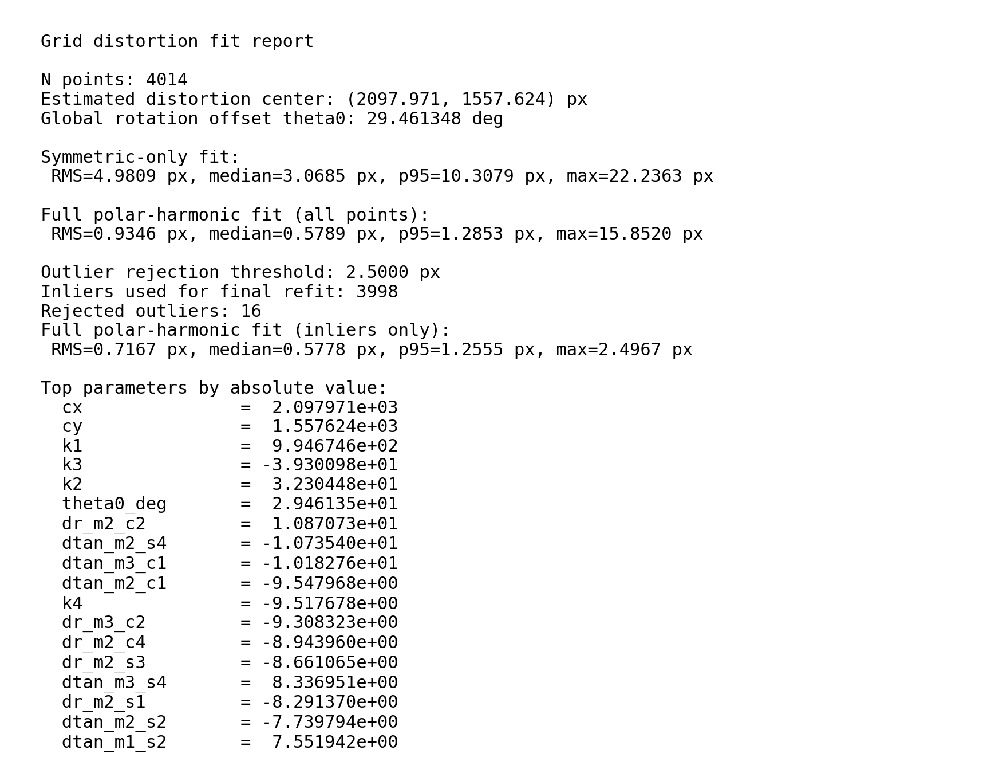

The model achieves sub-pixel accuracy after outlier rejection:

- RMS ≈ 0.7 px (inliers)
- Median ≈ 0.58 px
- Only a handful of outliers removed

---

Pixel-Space Residuals
---------------------

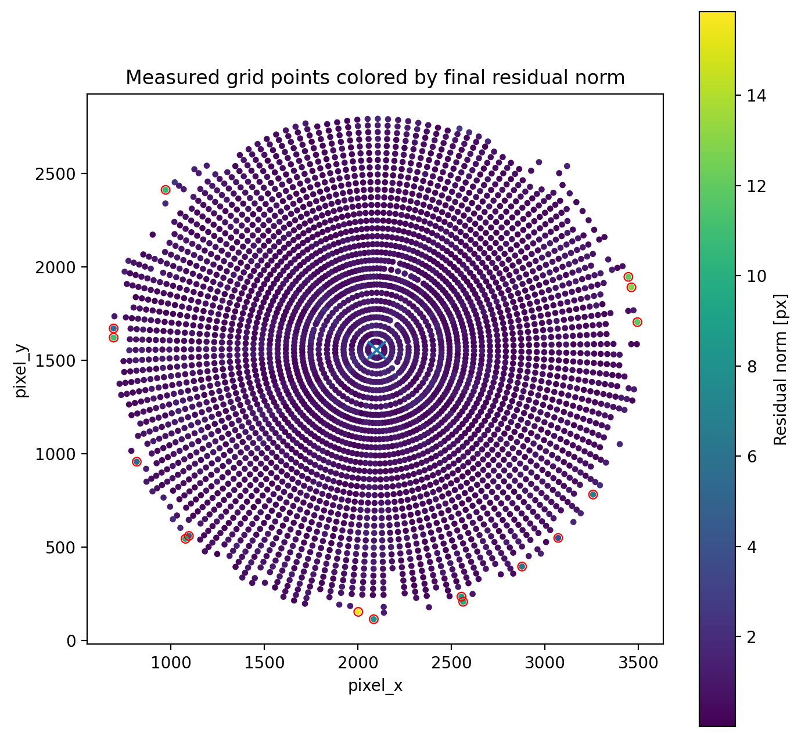

Residuals are spatially uniform, with slightly larger errors near the outer edge,
where contamination and detection errors are more likely.

---

Residuals in Nominal Space
--------------------------

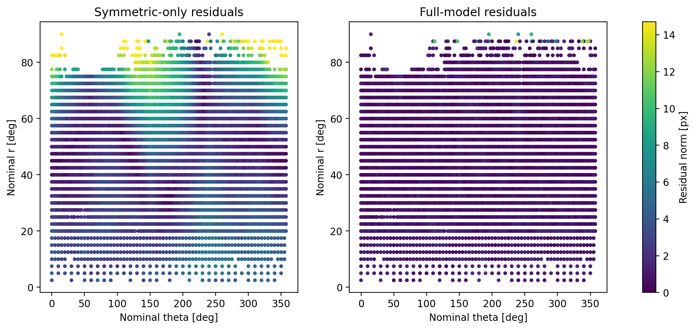

Before correction (left), strong structured residuals are present.

After applying the full model (right), residuals are nearly eliminated,
confirming that the distortion is well captured.

---

Residual Vector Fields
----------------------

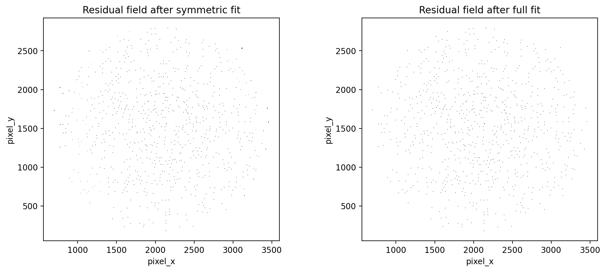

The symmetric model leaves large coherent distortions.
The full model removes these patterns almost entirely.

---

Radial and Tangential Components
--------------------------------

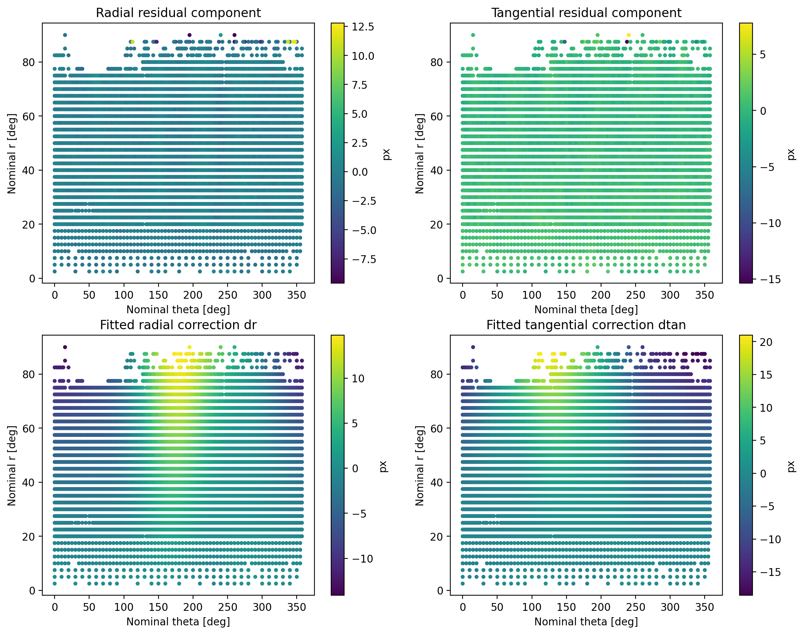

Residuals decompose naturally into:

- radial component (dominant)
- tangential component (smaller but structured)

The fitted correction fields (bottom panels) match these patterns closely.

---

Residuals vs Radius
-------------------

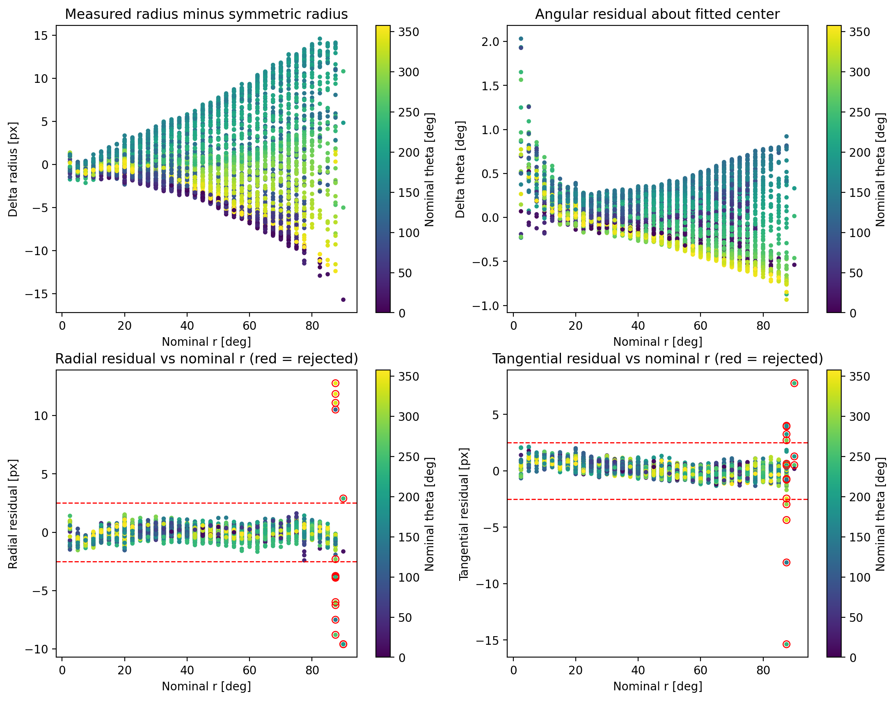

Key observations:

- Residuals are small across most of the field
- Outliers appear primarily at large radii
- Threshold-based rejection is effective

---

Residual Distributions
----------------------

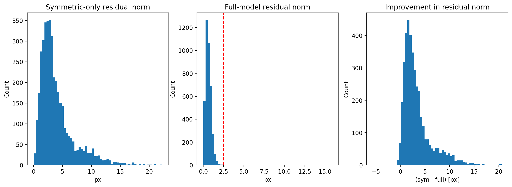

The full model significantly reduces the residual spread.

---

Residuals vs Angle
------------------

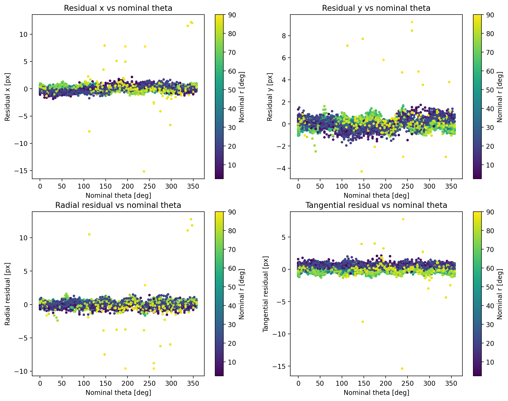

Residuals show minimal angular dependence after correction,
indicating that azimuthal distortions are properly modeled.

---

Distortion Magnitude
--------------------

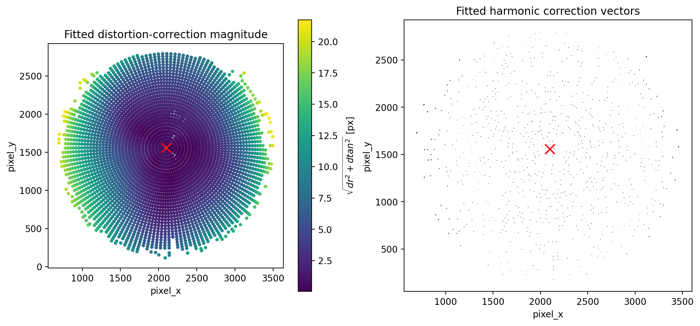

The distortion magnitude increases smoothly with radius,
as expected for a fisheye system.

---

Model-Predicted Grid Overlay
----------------------------

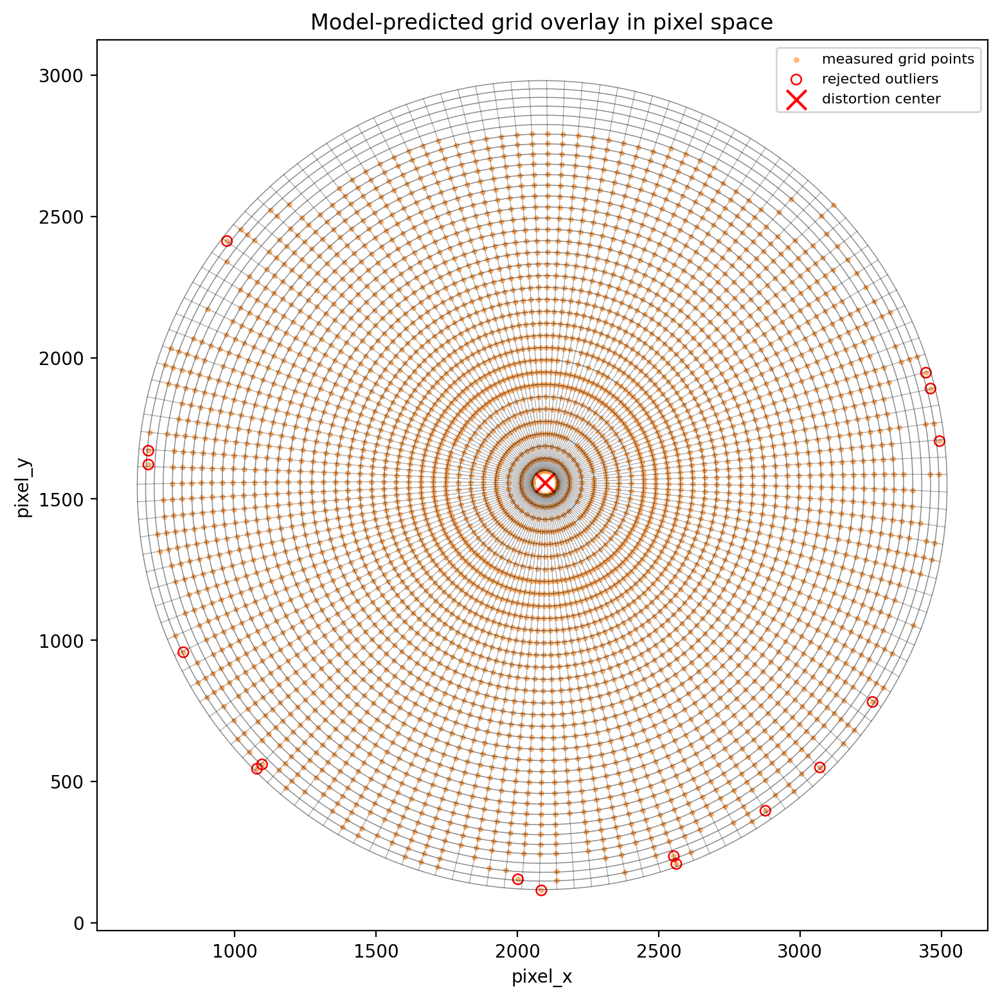

The predicted grid aligns extremely well with measured points,
validating the forward model.

---

Undistorted Grid Check
----------------------

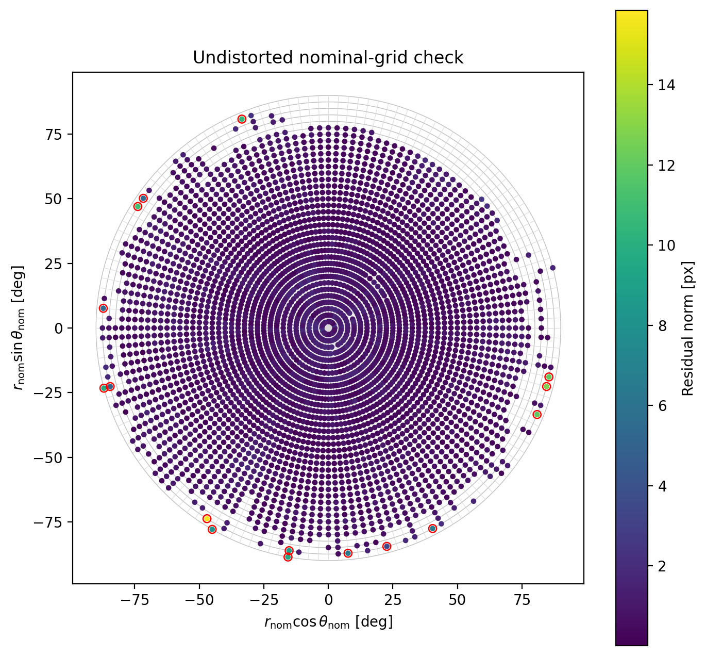

When mapped back to nominal coordinates, the grid becomes nearly perfect,
confirming the correctness of the inversion.

---

