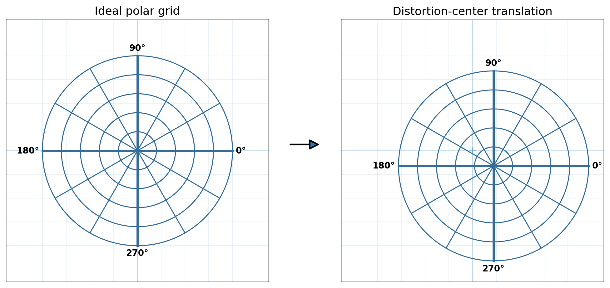
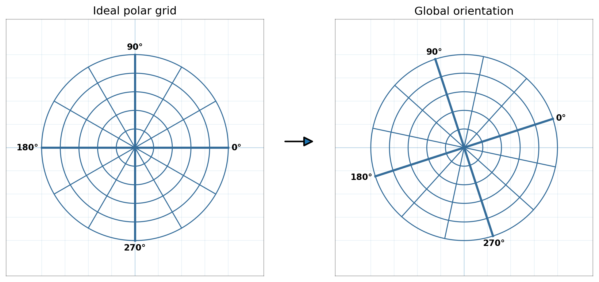
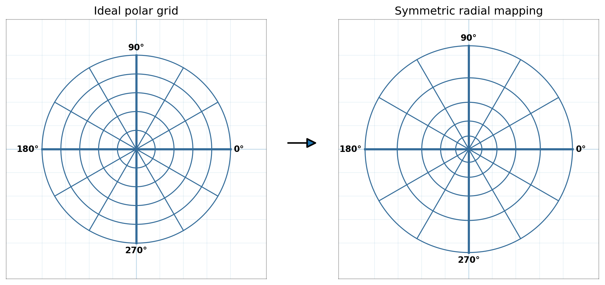
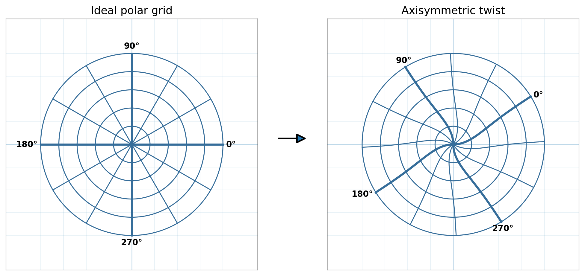
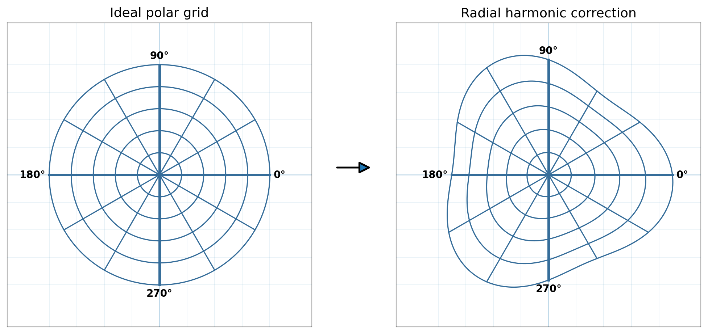
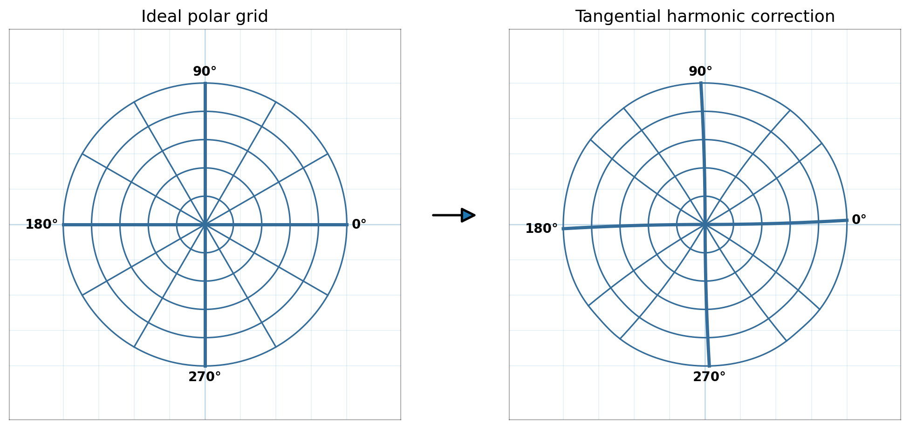
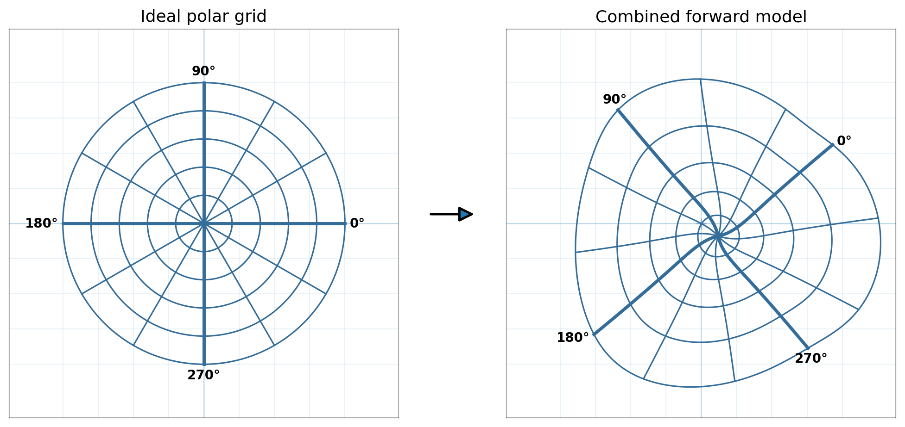

Geometric interpretation of the distortion model
=================================================

The final Grid Calibration mapping is deliberately flexible.  Its purpose is
to reproduce the measured geometry of the calibration grid accurately enough
that both the forward transformation

.. math::

   (r,\theta) \rightarrow (x,y)

and its numerical inverse

.. math::

   (x,y) \rightarrow (r,\theta)

remain accurate at the arcminute level over the calibrated field.

The model should therefore be understood as an **empirical geometric
calibration model**, not as a physical optical prescription.

This distinction is especially important for the current default model.  The
default configuration contains 159 fitted parameters.  The existence of these
parameters does **not** imply that the camera or lens has 159 physically
independent distortions.  Rather, a relatively large smooth basis is being used
to approximate a complicated two-dimensional mapping measured by the
calibration grid.

The model is nevertheless built from components that have useful geometric
interpretations.  This page describes those components individually.

The figures on this page are intentionally schematic.  Each distortion has
been greatly exaggerated so that its qualitative effect is obvious.  They do
not use fitted coefficients from a real calibration.

.. important::

   The model is referenced to the polar grid projected onto the Grainger Sky
   Theater dome, not to an independently perfect angular standard.  Repeatable
   imperfections in that projected pattern can therefore be absorbed by the
   same flexible terms that represent camera distortion.  See
   :ref:`calibration-reference-limitations` for the implications and the role
   of future stellar validation.

Forward model at a glance
-------------------------

Let the nominal grid coordinate be

.. math::

   (r,\theta),

where ``r`` is angular radius in degrees and ``theta`` is nominal azimuth.

Two normalized radial variables are useful:

.. math::

   u = \frac{\pi}{180}r

and

.. math::

   s = \frac{r}{r_{\mathrm{nom,max}}}.

The final pixel coordinate can be understood schematically as

.. math::

   \mathbf{p}(r,\theta)
   =
   \mathbf{c}
   +
   \left[
       \rho_{\mathrm{sym}}(u)
       +
       \Delta\rho(s,\phi)
   \right]\mathbf{e}_r(\phi)
   +
   \Delta t(s,\phi)\mathbf{e}_t(\phi),

where

.. math::

   \mathbf{c} =
   \begin{bmatrix}
   c_x\\
   c_y
   \end{bmatrix}

is the fitted distortion center,

.. math::

   \mathbf{e}_r(\phi)
   =
   \begin{bmatrix}
   \cos\phi\\
   \sin\phi
   \end{bmatrix}

is the local radial direction, and

.. math::

   \mathbf{e}_t(\phi)
   =
   \begin{bmatrix}
   -\sin\phi\\
   \cos\phi
   \end{bmatrix}

is the local tangential direction.

The effective orientation contains both a global rotation and the
radius-dependent twist,

.. math::

   \phi =
   \theta + \theta_0 + \tau(r).

The default model therefore has six conceptually different geometric pieces:

* the distortion center ``(cx, cy)``;
* the global orientation ``theta0``;
* the symmetric radial mapping;
* the axisymmetric radius-dependent twist;
* the non-axisymmetric radial correction field;
* the non-axisymmetric tangential correction field.

These components are described below.

Distortion center
-----------------

The first requirement is to determine the point about which the polar
distortion model should be constructed.

The fitted parameters

.. math::

   (c_x,c_y)

locate that center in detector coordinates.

This point need not coincide exactly with the geometric center of the image.
An offset can arise from camera alignment, sensor placement, lens alignment,
cropping, or other aspects of the imaging system.

Once this center has been chosen, every other model component is defined
relative to it.

   **Distortion-center translation.**  Translating the center moves the entire
   polar pattern with respect to the detector coordinate system.  Ring shapes,
   ring spacing, and spoke angles are otherwise unchanged in this schematic.

This is a rigid two-dimensional translation.  It does not itself describe
optical distortion.

Global orientation
------------------

The parameter

.. math::

   \theta_0

describes the rigid rotation between the nominal angular coordinate system of
the calibration grid and the detector coordinate system.

It changes every nominal azimuth by the same amount:

.. math::

   \theta \rightarrow \theta + \theta_0.

   **Global orientation.** The complete polar grid rotates relative to the fixed
   detector-coordinate frame. The highlighted 0°, 90°, 180°, and 270° spokes make
   the rigid rotation explicit; ring spacing and shape are unchanged.

A constant rotation is fundamentally different from the axisymmetric twist
described later.  ``theta0`` is independent of radius; the twist is not.

Symmetric radial mapping
------------------------

The dominant fisheye mapping is represented by the symmetric radial
polynomial

.. math::

   \rho_{\mathrm{sym}}(u)
   =
   \sum_{j=1}^{R} k_j u^j.

The current default uses

.. math::

   R=5.

The input radius ``r`` is angular radius, whereas
``rho_sym`` is a distance in detector pixels.

This component describes the mean relation

.. math::

   \text{angular distance from the optical axis}
   \quad\longrightarrow\quad
   \text{pixel distance from the distortion center}.

Because it is axisymmetric, every point at the same nominal radius receives
the same radial mapping.

   **Symmetric radial mapping.** The spacing and overall scale of the concentric
   rings change relative to the fixed detector-coordinate grid, while every ring
   remains circular and every spoke remains straight. This is the dominant
   axisymmetric fisheye projection.

The first radial coefficient describes the dominant scale.  Higher powers
allow the pixel-per-degree scale to vary continuously with field radius.

This component captures the large, smooth fisheye projection before the
non-axisymmetric correction fields are introduced.

Axisymmetric twist
------------------

The calibration data showed that a single rigid value of ``theta0`` was not
sufficient.

After the original model was inverted, many nominal spokes showed a common,
smooth transverse residual as a function of radius.  This indicated that the
effective angular orientation of the camera changes slightly across the field.

The selected model represents this with

.. math::

   \tau(r)
   =
   A_{\mathrm{twist}}
   \tanh\left(
       \frac{r}{r_{\mathrm{twist}}}
   \right).

The current default scale is fixed at

.. math::

   r_{\mathrm{twist}} = 20^\circ,

while the amplitude

.. math::

   A_{\mathrm{twist}}

is fitted for each calibration.

The twist vanishes at the center,

.. math::

   \tau(0)=0,

and approaches a finite asymptotic rotation at large radius.

   **Axisymmetric twist.**  Different radii are rotated by different amounts.
   Concentric rings remain circles, but a nominally straight spoke becomes a
   curved, spiral-like line.  The effect is exaggerated strongly here.

A polynomial twist was also capable of reducing residuals, but geometric
cross-validation showed that high-order polynomial twists were much less
stable when complete radial regions were withheld.  The saturating ``tanh``
form retained nearly the same accuracy while producing a much more stable
global geometry.

The twist should therefore be regarded as a compact empirical description of
a measured global torsional component of the mapping.  It should not
automatically be interpreted as a specific physical lens aberration.

Radial harmonic correction field
--------------------------------

The symmetric radial polynomial assumes that all azimuths behave identically.

Real calibration data do not satisfy this assumption exactly.

The model therefore adds a non-axisymmetric correction along the local radial
direction:

.. math::

   \Delta\rho(s,\phi)
   =
   \sum_{m=0}^{M_r}
   \sum_{n=1}^{N_r}
   s^m
   \left[
       a^{(r)}_{mn}\cos(n\phi)
       +
       b^{(r)}_{mn}\sin(n\phi)
   \right].

The current defaults are

.. math::

   M_r=4,\qquad N_r=7.

The correction is measured in pixels.

   **Radial harmonic correction.**  Points move inward or outward along their
   local radial directions.  Circular rings therefore acquire azimuth-dependent
   lobes or waves.  A single exaggerated harmonic mode is shown here; the
   production model is the sum of many modes.

The two indices have different meanings.

``n`` controls angular structure
~~~~~~~~~~~~~~~~~~~~~~~~~~~~~~~~

The harmonic order ``n`` determines how rapidly the correction changes around
azimuth.

For example,

.. math::

   \cos(\phi)

has one complete cycle around the image,

.. math::

   \cos(2\phi)

has two, and

.. math::

   \cos(7\phi)

has seven.

For every order both sine and cosine coefficients are fitted.  Together they
allow the phase of that angular mode to take any orientation.

``m`` controls radial evolution
~~~~~~~~~~~~~~~~~~~~~~~~~~~~~~~

The factor

.. math::

   s^m

controls how the amplitude of an azimuthal mode changes with field radius.

``m = 0`` allows an angular pattern whose amplitude is independent of radius.
Higher values increasingly weight the outer field.

A linear combination of

.. math::

   1,s,s^2,s^3,s^4

allows the amplitude of one azimuthal harmonic to grow, decrease, flatten, or
even change sign as a function of radius.

This radial dependence is important.  The calibration residuals showed that
the same azimuthal structure did not have a constant amplitude throughout the
field.

Tangential harmonic correction field
-------------------------------------

The radial harmonic field can move points inward or outward, but it cannot
move them sideways across a nominal spoke.

A second independent field therefore acts in the local tangential direction:

.. math::

   \Delta t(s,\phi)
   =
   \sum_{m=0}^{M_t}
   \sum_{n=1}^{N_t}
   s^m
   \left[
       a^{(t)}_{mn}\cos(n\phi)
       +
       b^{(t)}_{mn}\sin(n\phi)
   \right].

The current defaults are

.. math::

   M_t=4,\qquad N_t=8.

The correction is again measured in detector pixels.

   **Tangential harmonic correction.**  Points move perpendicular to the local
   radial direction.  Spokes therefore bow or move sideways rather than merely
   changing radial spacing.  The illustrated displacement is intentionally
   much larger than a real fitted correction.

This component was particularly important for astrometric accuracy.  The
inverse-calibration spoke tests exposed coherent cross-spoke residuals that
could not be represented adequately by the original lower-order field.

Why radial and tangential fields use different orders
-----------------------------------------------------

Earlier versions of the model used a single pair of harmonic limits for both
correction fields.

The calibration experiments showed that this constraint was unnecessarily
restrictive.

The final model uses

.. math::

   \Delta\rho:
   \quad M_r=4,\ N_r=7

and

.. math::

   \Delta t:
   \quad M_t=4,\ N_t=8.

The difference is small but meaningful.

The radial component was best represented by slightly smoother azimuthal
structure, while the tangential component benefited from one additional
azimuthal harmonic.

This configuration was not chosen from the full-grid residual alone.  Nearby
models were compared using geometric holdout tests in which complete spokes,
complete rings, contiguous azimuthal sectors, and contiguous radial bands were
removed from the fit.  Shifted blocked tests were also used so that the result
did not depend on a particular choice of sector boundaries.

The selected orders therefore represent a compromise between flexibility and
interpolation stability.

How 159 parameters arise
-------------------------

The current default parameter count can be accounted for directly.

The low-dimensional geometry contains:

.. code-block:: text

   center:
       cx, cy                                  2

   global orientation:
       theta0                                  1

   symmetric radial polynomial:
       k1 ... k5                               5

   tanh twist:
       fitted amplitude                        1
                                               --
                                                9

The radial harmonic field contains

.. math::

   2(M_r+1)N_r
   =
   2(5)(7)
   =
   70

coefficients.

The factor of two is the sine/cosine pair.

The tangential field contains

.. math::

   2(M_t+1)N_t
   =
   2(5)(8)
   =
   80

coefficients.

Therefore

.. math::

   9 + 70 + 80 = 159.

Why this should not be interpreted physically
---------------------------------------------

The parameter count is large because the harmonic fields are a generic basis
for a smooth two-dimensional vector correction field.

For each angular harmonic, the model allows an independent fourth-degree
radial envelope.  It does this independently for radial and tangential
displacements and fits both sine and cosine phase components.

That basis expands very quickly.

The resulting coefficients absorb whatever repeatable geometry is present in
the calibration measurements, potentially including contributions from:

* lens projection and non-axisymmetric optical distortion;
* lens/sensor alignment;
* projector alignment and projection geometry;
* physical calibration-grid or dome imperfections;
* small departures from ideal camera alignment;
* detector geometry;
* residual limitations in earlier calibration steps.

This is why the large parameter count should not be read as evidence for 159
independent optical aberrations.  The fitted surface describes the combined
geometry of the camera **and the realized calibration reference**.

The individual harmonic coefficients therefore do not correspond one-to-one
to physical aberrations.

In particular, a coefficient such as

.. code-block:: text

   dtan_m3_s8

should not be interpreted as a separately measurable physical property of the
lens.

The scientifically meaningful object is the **combined mapping** and its
validated residual field.

The model is better thought of as a smooth calibration surface represented in
a polar Fourier-polynomial basis.

Combined forward model
----------------------

The complete mapping applies all of the preceding effects together.

   **Combined schematic model.**  Translation, global rotation, fisheye radial
   scaling, radius-dependent twist, and non-axisymmetric radial/tangential
   corrections act together.  The distortion in this drawing is deliberately
   exaggerated and is not a rendering of a real calibration.

The important point is that the components do not represent independent
physical objects.  They are a useful mathematical decomposition of a single
smooth mapping.

Model selection and validation
------------------------------

The high-order model was adopted only after the original lower-order model
showed coherent residual structure in inverse angular coordinates.

The development process included:

* reproduction of the original production model in a standalone fitting
  sandbox;
* targeted tests of an axisymmetric radial twist;
* broad sweeps over symmetric radial degree, radial harmonic degree, angular
  harmonic order, regularization, basis choice, robust loss, and fitting
  objective;
* independent radial and tangential harmonic orders;
* geometric cross-validation that withheld complete spokes and rings;
* blocked azimuth and radius validation;
* shifted versions of the blocked validation tests;
* a final local confirmation sweep around the selected model.

The resulting default configuration is

.. code-block:: text

   symmetric radial degree:        5

   radial correction:
       radial degree:              4
       harmonic order:             7

   tangential correction:
       radial degree:              4
       harmonic order:             8

   axisymmetric twist:
       model:                      tanh
       scale:                      20 deg
       amplitude:                  fitted

The final full-grid verification showed substantial improvement relative to
the previous production model, particularly in coherent inverse angular
structure.

The purpose of this validation is not to demonstrate that every calibration
point can be fitted exactly.  A model with enough degrees of freedom could
always drive an in-sample residual downward.

Instead, the goal is to obtain a smooth mapping that continues to predict the
geometry when complete regions of the calibration grid are withheld.

Regularization and robust fitting
---------------------------------

The geometric equations above describe the mapping itself.

The fitting procedure additionally uses robust residual handling,
outlier rejection, and non-zero regularization of the harmonic correction
fields.

These mechanisms should not be confused with geometric model components.

Regularization is especially important for a high-dimensional basis.  It
discourages unnecessarily large harmonic coefficients and helps preserve a
well-behaved continuous mapping between measured calibration structures.

Likewise, robust fitting prevents a small number of individual grid-point
errors from forcing high-order modes to reproduce isolated measurements.

Interpreting a fitted calibration
---------------------------------

When evaluating a fitted model, global pixel RMS alone is insufficient.

A calibration can have a good pixel-space RMS while retaining coherent
angular structure that is important for astrometric applications.

The standard modeling report therefore also evaluates the inverse mapping and
reports quantities such as:

.. code-block:: text

   inverse radial residuals
   inverse cross-spoke residuals

   ring residual structure
   spoke residual structure

   robust scatter
   P95 absolute residuals
   coherent smooth peak-to-peak excursions

The most useful interpretation of the model is therefore not

.. code-block:: text

   "what does coefficient number 117 mean physically?"

but rather

.. code-block:: text

   "does this combined mapping reconstruct unseen grid geometry smoothly
    and without coherent angular residual structure?"