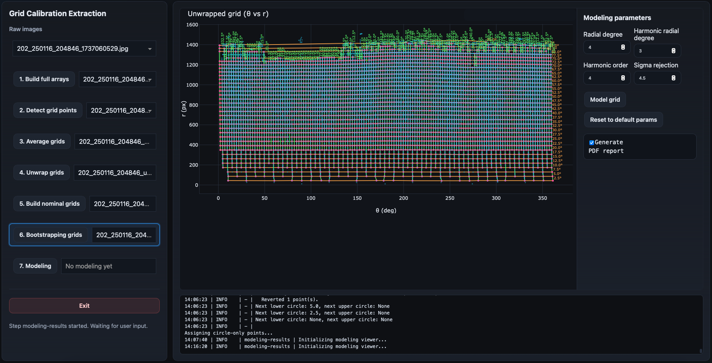
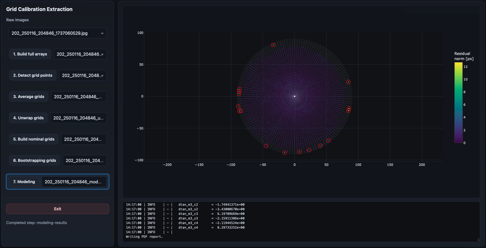

Modeling Results
================

The modeling-results step fits the final fisheye distortion model using the
dense bootstrapped calibration grid.

This is the final stage of the calibration workflow.

Overview
--------

The previous stages progressively transformed the raw calibration images into a
dense set of correspondences between:

- measured image coordinates,
- measured polar coordinates,
- and ideal nominal grid coordinates.

The goal of the modeling stage is to fit a smooth parametric distortion model
that maps between the ideal grid geometry and the observed fisheye projection.

Interactive Initialization
--------------------------

When the step begins, the GUI displays the bootstrapped grid together with the
modeling controls.

The side panel exposes the main fitting parameters.

Unlike earlier stages, this step focuses primarily on numerical optimization and
diagnostic analysis rather than geometric editing.

Inputs
------

This step consumes the singleton bootstrapped-grid product.

Typical input product:

.. code-block:: text

    *_bootstrapped_grid.npz

Outputs
-------

This step generates one singleton modeling-results product.

Typical workflow output product:

.. code-block:: text

    *_modeling_results.npz

The modeling step also exports a portable calibration sidecar:

.. code-block:: text

    *_calibration.npz

The portable artifact contains only numerical, boolean, and string arrays and
is readable with ``numpy.load(..., allow_pickle=False)``. It records the artifact
format/version, image-coordinate convention, sensor dimensions, model-basis
configuration, normalization radius, fitted parameter vector, fit-quality
summary, and calibrated angular range. Unlike ``*_modeling_results.npz``, it
does not serialize a Python ``FitResult`` object and is intended as the stable
input for downstream applications.

Optionally, a PDF diagnostic report may also be generated:

.. code-block:: text

    *_modeling_report.pdf

The output product stores:

- the fitted model parameters,
- residual diagnostics,
- inlier masks,
- predicted model coordinates,
- optimization summaries,
- and the fitting configuration used.

Goal of the Modeling Stage
--------------------------

The calibration target provides known nominal geometry.

The measured fisheye image introduces distortions caused by:

- lens projection,
- optical misalignment,
- detector offsets,
- asymmetric distortions,
- and higher-order optical effects.

The modeling stage estimates a smooth transformation capable of reproducing the
observed projection geometry.

Calibration Reference and Limitations
-------------------------------------

The nominal geometry used by this project comes from the polar calibration grid
projected onto the dome of the **Grainger Sky Theater at the Adler
Planetarium**.  During fitting, those nominal ring radii and spoke angles are
treated as the angular reference.

This is a practical and densely sampled reference, not a perfect external
metrological standard.  Small projector misalignments, projection geometry,
local dome imperfections, or other repeatable departures from the ideal pattern
can therefore be absorbed by the fitted model.  In that situation the model is
calibrating the camera **relative to the realized projected grid**, not the
camera optics in isolation.

This distinction matters because the current model is intentionally flexible.
A repeatable imperfection in the projected pattern can be represented just as
readily as a repeatable distortion in the camera.  Any such reference-grid
systematic can consequently propagate into the exported pixel-to-angle
calibration.

Independent star-tracking tests have already provided evidence that the
projected grid is not a perfectly ideal absolute reference.  Stars are an
attractive independent angular standard, but obtaining dense, unobstructed
stellar sampling over the complete fisheye field, particularly toward the
horizon, is difficult in practice.  A future hybrid approach may therefore be
strongest: use the projected grid for dense full-field constraints and stars
for independent absolute validation and additional geometric anchoring.

See :doc:`../../calibration/index` for the technical model documentation and a
more detailed discussion of what the fitted coefficients do and do not mean.

High-Level Strategy
-------------------

The fitting procedure models the distortion as a combination of:

- a radial distortion model,
- harmonic azimuthal perturbations,
- and global geometric alignment terms.

The workflow then optimizes the model parameters to minimize the residual
distance between:

- measured calibration points,
- and model-predicted positions.

The fitting routines are implemented in the modeling processing package:

``model.py``
    Core parametric distortion model definitions.

``fitting.py``
    Numerical optimization and iterative fitting logic.

``data.py``
    Construction of fitting datasets and residual structures.

``results.py``
    Containers for optimization outputs and diagnostics.

``reporting.py``
    PDF report generation and summary visualization.

``pipeline.py``
    High-level orchestration of the full fitting workflow.

Radial Distortion Model
-----------------------

The dominant fisheye behavior is modeled through a radial distortion expansion.

The parameter:

``Radial degree``

controls the polynomial complexity of the radial distortion model.

Higher degrees allow the model to capture more complex radial behavior but may
increase the risk of overfitting.

Harmonic Distortion Terms
-------------------------

Real optical systems are rarely perfectly radially symmetric. The current model
therefore fits independent radial and tangential harmonic fields. The GUI
exposes four complexity controls:

``dr radial degree``
    Radial polynomial degree of the radial correction field.

``dr harmonic order``
    Maximum Fourier order of the radial correction field.

``dtan radial degree``
    Radial polynomial degree of the tangential correction field.

``dtan harmonic order``
    Maximum Fourier order of the tangential correction field.

The production defaults are ``dr M4/N7`` and ``dtan M4/N8``. They are separate
because geometric cross-validation showed that the two physical residual
components prefer slightly different complexity.

The model also includes a global radius-dependent angular twist
``A*tanh(r/tau)``. ``Twist scale (deg)`` controls the fixed scale ``tau``; the
default is 20 degrees and the amplitude ``A`` is fitted.

Outlier Rejection
-----------------

The fitting pipeline includes iterative sigma clipping to reject problematic
points.

The parameter:

``Sigma rejection``

controls the clipping threshold.

Points with residuals exceeding the threshold are excluded from later fitting
iterations.

This improves robustness against:

- incorrect propagated assignments,
- residual false detections,
- local image artifacts,
- unstable outer-edge points.

Optimization Procedure
----------------------

The fitting proceeds iteratively:

1. construct the fitting dataset,
2. evaluate the current distortion model,
3. compute residuals,
4. reject outliers,
5. update the model parameters,
6. repeat until convergence.

The numerical optimization minimizes the residual separation between measured
and predicted point locations.

The fitting system stores both:

- the symmetric radial-only solution,
- and the full harmonic solution.

Generating the Model
--------------------

Once the parameters are configured, the user clicks:

.. code-block:: text

    Model grid

The optimization may require noticeable processing time depending on:

- model complexity,
- number of calibration points,
- harmonic order,
- outlier rejection settings.

The log window reports the fitting progress and parameter evolution. 

Optional PDF Report
-------------------

The GUI optionally generates a PDF diagnostic report.

This behavior is controlled through the:

.. code-block:: text

    Generate PDF report

checkbox.

The report includes:

- forward residual statistics and maps,
- parameter summaries and inlier diagnostics,
- radial/tangential distortion visualizations,
- inverse angular residual statistics,
- ring and spoke coherent-structure summaries,
- and the fitted axisymmetric twist curve.

The callbacks explicitly invoke the reporting pipeline only when the PDF option
is enabled. 

Final Diagnostic Visualization
------------------------------

Once the fitting completes, the GUI displays the residual diagnostics.

The visualization shows:

- the fitted calibration grid,
- residual magnitudes,
- spatial residual distribution,
- outlier locations.

Residuals are color-coded by magnitude.

Outliers rejected during fitting are highlighted explicitly.

Interpreting the Residual Map
-----------------------------

The residual plot is one of the most important validation tools in the entire
workflow.

A good fit generally shows:

- small residuals across most of the field,
- smooth spatial behavior,
- no large coherent structures,
- limited edge instability,
- few extreme outliers.

Large coherent residual patterns may indicate:

- insufficient model complexity,
- incorrect nominal assignments,
- poor center selection,
- incomplete bootstrapping,
- or physical optical asymmetries not captured by the model.

What a Good Result Looks Like
-----------------------------

A good final solution generally has:

- low median residuals,
- low maximum residuals,
- smooth residual distribution,
- stable harmonic structure,
- and only a small number of rejected outliers.

Residuals should remain visually small compared to the grid spacing.

Final Calibration Products
--------------------------

Once the fit completes successfully, the modeling-results product is written to
disk and registered automatically in the calibration session. The portable
``*_calibration.npz`` sidecar is written alongside it for external consumers.

The package-level API can load this artifact and evaluate either direction of
the calibration:

.. code-block:: python

    from grid_calibration import load_calibration

    calibration = load_calibration("camera_calibration.npz")

    x, y = calibration.angle_to_pixel(r_deg=45.0, theta_deg=120.0)
    r_deg, theta_deg = calibration.pixel_to_angle(x, y)

The inverse is solved numerically against the complete fitted forward model,
including the independent radial/tangential harmonic corrections and the
axisymmetric tanh twist. By default it refuses to
silently extrapolate beyond the calibrated outer angular radius; pass
``extrapolate=True`` only when that behavior is intentional.

Additional Documentation
------------------------

The dedicated :doc:`../../calibration/index` section collects the technical
model documentation:

* :doc:`../../calibration/model_components` gives a visual, geometric
  explanation of each model component and the 159-parameter default.
* :doc:`../../calibration/distortion_model` gives the mathematical
  parameterization, fitting procedure, regularization, validation strategy,
  and exported-product details.

These pages are optional for routine calibration operation, but they are the
recommended reference when interpreting structured residuals or changing the
model.

End of the Pipeline
-------------------

This is the final workflow stage.

The resulting distortion model can now be used for:

- fisheye calibration,
- coordinate reconstruction,
- astrometric projection,
- image reprojection,
- and downstream scientific analysis.